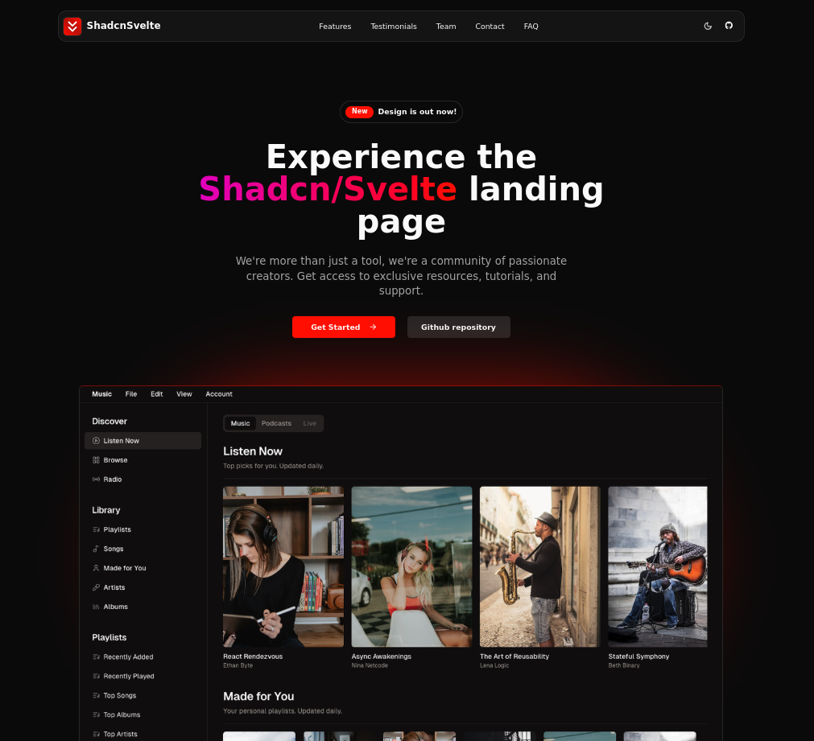

# Shadcn/Svelte Landing Page Template

### This is a project conversion from <a href="https://github.com/leoMirandaa/shadcn-vue-landing-page" target="_blank">Shadcn-Vue</a> to SvelteKit

## <a href="https://www.shadcn-svelte.com/" target="_blank">Shadcn-Svelte</a> + <a href="https://kit.svelte.dev/" target="_blank">SvelteKit</a> + <a href="https://www.typescriptlang.org/" target="_blank">TypeScript</a> + <a href="https://tailwindcss.com/" target="_blank">Tailwind</a>.



Live demo is now available: <a href="https://shadcn-sveltekit-landing-page.zxce3.net" target="_blank">Live Demo</a>

## Sections

- [x] Navbar
- [x] Sidebar(mobile)
- [x] Hero
- [x] Sponsors
- [x] Benefits
- [x] Features
- [x] Services
- [x] HowItWorks
- [x] Testimonials
- [x] Pricing
- [x] Frequently Asked Questions(FAQ)
- [x] Team
- [x] Community
- [x] Contact
- [x] Footer

## Features

- [x] Fully Responsive Design
- [x] User Friendly Navigation
- [x] Dark Mode
- [x] Meta tags

## How to install

1. Clone this repository:

```bash
git clone https://github.com/zxce3/shadcn-sveltekit-landing-page.git
```

2. Go into project

```bash
cd shadcn-sveltekit-landing-page
```

3. Install dependencies

```bash
npm install
# or
pnpm install
# or
yarn install
```

4. Run development server

```bash
npm run dev
# or
pnpm dev
# or
yarn dev
```

5. Open your browser and visit `http://localhost:5173`

## Building for Production

To create a production version of your app:

```bash
npm run build
```

You can preview the production build with:

```bash
npm run preview
```

> To deploy your app, you may need to install an [adapter](https://kit.svelte.dev/docs/adapters) for your target environment.
